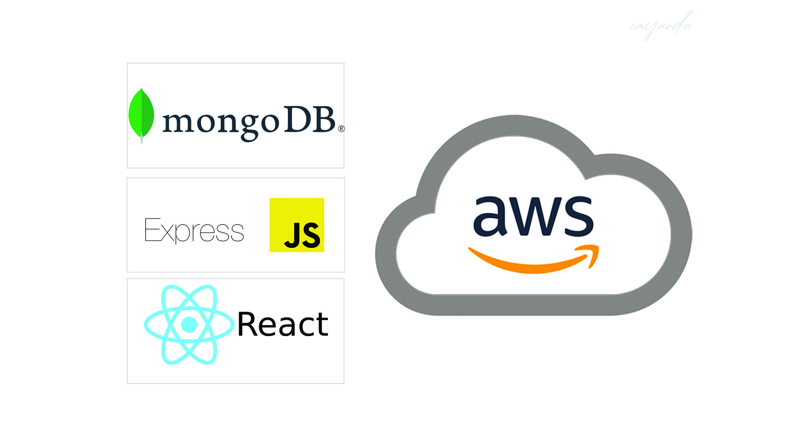

# MERN-STACK-IMPLEMENTATION-ON-AWS

This project explains how a MERN stack can be implemented in AWS Cloud. I will host a  ***Simple To Do*** web application on Ubuntu Server in AWS EC2.

---

> **M**ongoDB - is a document-based, No-SQL database used to store application data in a form of documents.

> **E**xpressJS - is a back end web application framework for Node.js, released as free and open-source software under the MIT License. It is designed for building web applications and APIs. It has been called the de facto standard server framework for Node.js.

> **R**eactJS - is a frontend framework developed by Facebook.  is a free and open-source front-end JavaScript library for building user interfaces based on UI components.

> **N**odeJS - is an open-source, cross-platform, back-end JavaScript runtime environment that runs on the V8 engine and executes JavaScript code outside a web browser, which was designed to build scalable network applications..

*Implementation instructions* - [Click Here](https://github.com/oayanda/MERN-STACK-IMPLEMENTATION-ON-AWS/blob/main/project3.md)
