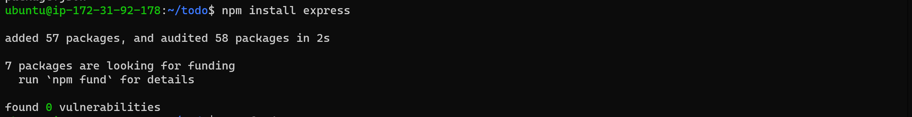

### STEP ONE – BACKEND CONFIGURATION
> *Make sure you have a functioning AWS account (Free tier or Paid account)*

> For this demostration, I am using a free tier account which is connected remotely to my windows computer.

1. Let's install the packages needed for the backend.

```bash
sudo apt update
```

```bash
sudo apt upgrade
```

Lets get the location of Node.js software from Ubuntu repositories.

```bash
curl -fsSL https://deb.nodesource.com/setup_18.x | sudo -E bash -
```


Install Node.js on the server and npm(node package manager).
```bash
sudo apt-get install -y nodejs
```


Verify node and node package manager are installed.
package manager).
```bash
node -v
```
```bash
npm -v
```


Let's create the directory/domain to store our todo application files.
```bash
npm -v
```


Change directory to the project directory ***todo***.
```bash
cd todo
```


Initialise the project, that creates the package.json file that holds the mta data to manage the application and it's dependancies.
```bash
npm init
```


Notice the newly created ***package.json file***
```bash
ls
```


Next, Install ExpressJs and create the Routes directory.

Install ExpressJS
```bash
npm install express
```


Create the index page for the todo application
```bash
touch index.js
```

Install the dotenv module - environment variables
```bash
npm install dotenv
```


Open the index.js file and type this codes
```bash
nano index.js
```


Start the server
```bash
node index.js
```


Remember port 5000 was specified in the index.js file create. we would need to open this port under the security group fiie AWS EC2 instance.


Verify in the broswer - use your public ip or public dns.
```bash
http://44.203.110.111:5000/
```


Create ROUTES.
The ***Todo application*** is created to perform (3) actions namely, create, display and delete. These actions would be associated with endpoints using HTTP standards - POST, GET and DELETE.

Create Routes directory and change to it's directory
```bash
mkdir routes
```


Create API file, open and type the codes as shown in the image below.
```bash
touch api.js
```
```bash
nano api.js
```


MODELS
Create models neccessary for the database schema.
```bash
npm install mongoose
```


Create a directory for models, change to the directory and create a new file called *todo.js*
```bash
mkdir models
```
```bash
cd models
```
```bash
touch todo.js
```

Create schema - write the following codes in the image below. save and exit
```bash
nano todo.js
```


Update **routes** in the ***api.js*** file.
```bash
nano api.js
```


MONGODB - Let's setup the database.

